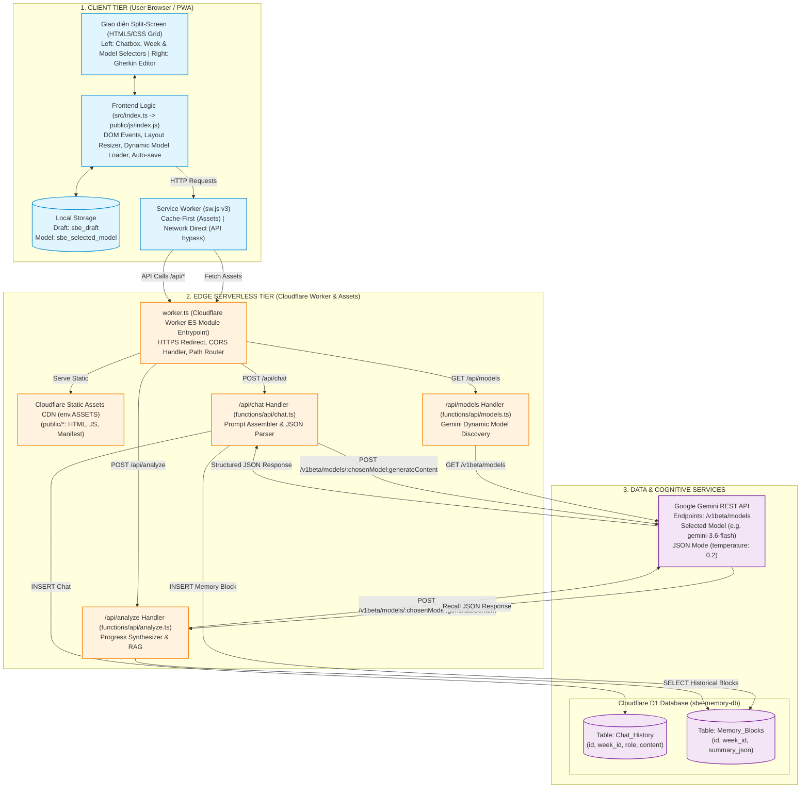
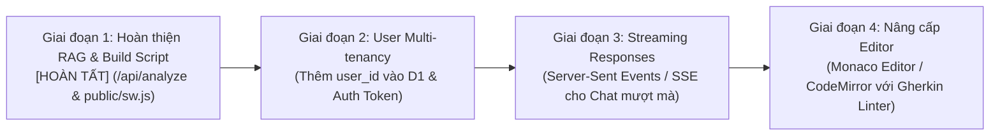

# TÀI LIỆU KIẾN TRÚC HỆ THỐNG: PERSONAL SBE ASSISTANT PWA

> **Vai trò:** Software Architect  
> **Dự án:** Personal SBE Assistant PWA  
> **Ngày cập nhật:** 2026-09-20  
> **Phiên bản:** 1.0.0

---

## 1. Tổng quan Dự án (Project Overview)

### 1.1. Mục đích & Bài toán Giải quyết

**Personal SBE Assistant PWA** là một ứng dụng trợ lý học tập cá nhân hóa chuyên sâu theo mô hình **AI Mentor**, hướng dẫn người học nắm vững phương pháp **Specification by Example (SBE)** và cú pháp kịch bản **Gherkin** trong lộ trình 4 tuần:

- **Tuần 1:** Nền tảng Gherkin (_Given - When - Then_).
- **Tuần 2:** Kịch bản tham số hóa (_Scenario Outlines & Examples Tables_).
- **Tuần 3:** Tư duy thiết kế bên ngoài vào (_Outside-In & Edge Cases_).
- **Tuần 4:** Tài liệu sống động (_Living Documentation & Refactoring_).

**Vấn đề cốt lõi được giải quyết:**

1. **Khắc phục giới hạn Context Window của LLM:** Thay vì nhồi nhét toàn bộ lịch sử hội thoại dài vào mỗi lần gọi API gây tốn chi phí và mất tập trung ("LLM forgetfulness"), hệ thống trích xuất và cô đọng tiến trình học tập thành **5 khối JSON (Memory Blocks)** có cấu trúc.
2. **Hỗ trợ RAG (Retrieval-Augmented Generation) trên Edge:** Bộ nhớ dài hạn được lưu trữ tại Cloudflare D1 trên mạng biên (Edge Network), cho phép truy vấn tổng hợp tiến trình học tập của từng tuần mà không cần hạ tầng máy chủ phức tạp.
3. **Trải nghiệm PWA & Khả năng hoạt động Ngoại tuyến (Offline-First Resiliency):** Tự động lưu nháp kịch bản (_Auto-save draft_) vào `localStorage`, Service Worker xử lý cache tài nguyên tĩnh và bắt lỗi ngắt kết nối mạng an toàn (trả về fallback HTTP 503 thay vì làm sập ứng dụng).

### 1.2. Tech Stack Chi tiết

| Tầng (Layer)                  | Công nghệ / Thư viện                                                            | Vai trò kỹ thuật & Quyết định kiến trúc                                                                                                     |
| :---------------------------- | :------------------------------------------------------------------------------ | :------------------------------------------------------------------------------------------------------------------------------------------ |
| **Client / Presentation**     | HTML5, CSS Grid/Flexbox                                                         | Giao diện Split-Screen 3 cột (Chatbox 60% - Thanh kéo chia đôi - Gherkin Editor 40%), không dùng framework nặng để tối ưu tốc độ tải trang. |
| **Client Scripting**          | TypeScript (`ES2020`, `module: ESNext`)                                         | Đảm bảo Type Safety cho Data Payload, bắt sự kiện DOM, tương tác `localStorage` và fetch API.                                               |
| **Offline & PWA**             | Service Worker (`Cache-First` + `Network-First API fallback`), Web App Manifest | Cài đặt ứng dụng lên Home Screen thiết bị (standalone), cache shell tĩnh, bắt ngoại lệ mạng khi gọi API.                                    |
| **Edge Compute / Serverless** | Cloudflare Pages Functions / Worker                                             | Runtime V8 Isolate siêu nhẹ trên Edge, không có cold-start, xử lý các endpoint `/api/chat`, `/api/analyze`, `/api/models`.                  |
| **AI / LLM Engine**           | Google Gemini API (Mặc định: `gemini-3.6-flash`, Dynamic Model Switcher)        | Tự động cập nhật danh sách model từ Google List Models API, ép kiểu cấu trúc JSON (`response_mime_type: "application/json"`).               |
| **Database / Persistence**    | Cloudflare D1 (Distributed SQLite)                                              | Cơ sở dữ liệu quan hệ phân tán tại Edge, lưu trữ `Chat_History` và `Memory_Blocks`.                                                         |
| **CI/CD & DevOps**            | Cloudflare Pages Native CI/CD + Wrangler CLI                                    | Tự động build từ Git repository (`npm run build`), deploy tự động ra môi trường production.                                                 |

---

## 2. Phân tích Cấu trúc Thư mục & Vai trò File

```plaintext
sbe-assistant-pwa/
├── .github/                       # Cấu hình GitHub (đã lược bỏ workflow để dùng Cloudflare Native CI)
├── .wrangler/                     # Thư mục cache và state của Wrangler CLI
├── functions/                     # Backend Serverless chạy trên Cloudflare Pages Functions
│   └── api/
│       ├── chat.ts                # Edge Handler: tiếp nhận kịch bản, gọi Gemini API, ghi D1
│       ├── analyze.ts             # Edge Handler (RAG): trích xuất Memory_Blocks, tổng hợp tiến độ học
│       └── models.ts              # Edge Handler: truy vấn danh sách Gemini models hiện hành từ Google API
├── public/                        # Thư mục đích phân phối tĩnh (Web Root của Pages)
│   ├── index.html                 # Giao diện chính: Split-Screen Layout, Chatbox, Model Selector & Editor
│   ├── manifest.json              # Khai báo Metadata PWA (icons, theme_color, display standalone)
│   ├── sw.js                      # Service Worker xử lý Cache Storage & bắt lỗi Offline
│   └── js/
│       └── index.js               # Mã nguồn JS được biên dịch từ src/index.ts
├── src/                           # Mã nguồn Frontend TypeScript
│   └── index.ts                   # Logic xử lý sự kiện giao diện, kéo thả resizer, nạp model động, auto-save
├── worker.ts                      # Cloudflare Worker ES module entrypoint (routing API & Assets)
├── .dev.vars                      # Biến môi trường local (chứa GEMINI_API_KEY, đã gitignore)
├── .gitignore                     # Bỏ qua node_modules, .dev.vars, build cache
├── package.json                   # Định nghĩa dependencies, scripts build và dev
├── schema.sql                     # Khởi tạo lược đồ DDL cho Cloudflare D1
├── tsconfig.json                  # Cấu hình TypeScript Compiler (ESNext, outDir: ./public/js)
├── wrangler.jsonc                 # Cấu hình Cloudflare Worker/Pages, Assets directory & D1 Database Binding
└── SBE-Assistant-Master-Document.md # Tài liệu tổng hợp kiến trúc và lộ trình gốc
```

### Vai trò chi tiết của các file trọng yếu

1. **`functions/api/chat.ts` (Backend API Gateway & Agent Controller - Dual Mode):**
   - **Xử lý Request (Chế độ Kép):**
     - **Chế độ 1 - Đánh giá Kịch bản Gherkin:** Nhận `{ currentWeek, scenarioText, model }`. Ép kiểu JSON 5 khối (`message`, `analysis.learned_concepts`, `mistakes`, `best_scenario`, `recommendations`). Lưu đồng thời vào `Chat_History` và `Memory_Blocks` (D1).
     - **Chế độ 2 - Trò chuyện Tự do (Free-form Mentoring):** Nhận `{ currentWeek, message, model }`. Đọc lịch sử 4 lượt trao đổi gần nhất từ D1 làm giàu ngữ cảnh. Gọi Gemini API trả lời với vai trò SBE Mentor cố vấn sư phạm. Lưu tin nhắn người dùng và câu trả lời vào `Chat_History`.
   - **Tương thích & Dự phòng:** Hỗ trợ biến môi trường `GEMINI_BASE_URL` (AI Gateway) và cơ chế bắt lỗi hạn chế địa lý `isLocationBlocked`.

2. **`functions/api/analyze.ts` (Edge RAG Analyzer & Progress Synthesizer):**
   - **Xử lý Request:** Nhận POST payload chứa `{ currentWeek, model }`.
   - **Truy vấn Cloudflare D1:** Đọc toàn bộ các bản ghi `Memory_Blocks` từ tuần 1 đến tuần hiện tại.
   - **Xử lý Empty State:** Nếu chưa có kịch bản nào được nộp, trả về thông báo hướng dẫn gửi kịch bản.
   - **Tổng hợp Gemini RAG:** Gửi toàn bộ dữ liệu lịch sử cho mô hình đã chọn (mặc định `gemini-3.6-flash`) phân tích tổng quan, trích xuất các khái niệm đã làm chủ, lỗi sai lặp lại, kế hoạch hành động tiếp theo và chấm điểm mức độ sẵn sàng (`readiness_score: 0-100`).

3. **`functions/api/models.ts` (Edge Dynamic Gemini Models Discovery Provider):**
   - **Xử lý Request:** Nhận GET request tại `/api/models`.
   - **Truy vấn Google Generative Language API:** Gọi trực tiếp `GET https://generativelanguage.googleapis.com/v1beta/models?key=${apiKey}` để lấy danh sách models mới nhất từ Google.
   - **Bộ lọc & Sắp xếp thông minh:** Lọc các model thuộc họ `gemini` hỗ trợ `generateContent` (loại bỏ vision/embedding riêng biệt), ưu tiên đưa `gemini-3.6-flash` lên đầu làm model khuyến nghị mặc định.
   - **Fallback Resiliency:** Nếu không có API Key hoặc mạng gặp sự cố, tự động trả về danh sách fallback an toàn (`gemini-3.6-flash`, `gemini-1.5-flash`, `gemini-1.5-pro`) với HTTP 200 kèm cảnh báo mềm.

4. **`worker.ts` (Cloudflare Worker Core Gateway & Asset Router):**
   - Đóng vai trò ES Module entrypoint cho Cloudflare Worker.
   - Bắt buộc giao thức HTTPS (HTTP 308 Permanent Redirect) để bảo vệ toàn vẹn POST method và request body.
   - Điều phối định tuyến API: `/api/chat`, `/api/analyze`, `/api/models`.
   - Bổ sung header CORS chuẩn (`Access-Control-Allow-Origin: *`, `Allow-Methods`, `Allow-Headers`).
   - Phục vụ static assets từ `env.ASSETS` cho các tài nguyên trình duyệt.

5. **`src/index.ts` (Frontend Controller & Presentation Logic):**
   - **Dynamic Model Selection:** Tự động gọi `/api/models` nạp vào thẻ dropdown `#modelSelector`, ghi nhớ model đã chọn vào `localStorage.getItem("sbe_selected_model")`, truyền model vào các request `/api/chat` và `/api/analyze`.
   - **Khôi phục & Lưu nháp:** Tự động nạp bản nháp từ `localStorage.getItem("sbe_draft")` khi khởi động; lắng nghe `input` trên editor để lưu tức thời.
   - **Resizer Controller:** Lắng nghe sự kiện chuột (`mousedown`, `mousemove`, `mouseup`) trên thanh chia đôi `#dragMe`, giới hạn tỷ lệ co giãn từ 20% đến 80%, tạm thời vô hiệu hóa `pointer-events` trên các khung để tránh giật lag.
   - **Dispatcher & Renderer:** Gửi request đến `/api/chat` và `/api/analyze`, quản lý loading states trên các nút tương ứng.
   - **Recall Dashboard:** Render thẻ tóm tắt tiến trình học tập trực quan gồm điểm sẵn sàng, danh sách khái niệm nắm vững, lỗi cần khắc phục và kế hoạch hành động.
   - **PWA Lifecycle:** Đăng ký Service Worker `/sw.js` vào browser khi tải trang.

6. **`public/index.html` (Application Shell & UI Layout):**
   - Sử dụng CSS Grid 3 cột (`60% 5px 1fr`) tạo bố cục 2 vùng làm việc song song: bên trái là khung trao đổi với AI Mentor kèm bộ lọc tuần (`weekSelector`), bộ chọn model AI (`modelSelector`) và nút "Tổng kết (Recall)"; bên phải là workspace viết Gherkin Editor.
   - Tích hợp script auto-redirect HTTP sang HTTPS ngay tại `<head>` để bảo toàn POST payloads.
   - Liên kết Web App Manifest phục vụ khả năng Add to Home Screen.

7. **`public/sw.js` (Offline Cache & Network Proxy - v3):**
   - Định vị trực tiếp tại Web Root (`public/sw.js`) để đảm bảo scope đăng ký `/` toàn vẹn.
   - Chiến lược **Cache-First** đối với các static assets cơ bản (`/`, `/index.html`, `/js/index.js`, `/manifest.json`).
   - Sửa lỗi body consumption: chỉ clone `Response` an toàn khi request là GET thành công và hoàn toàn bypass đối với route `/api/*`.

8. **`schema.sql` (Edge Database Data Definition Language):**
   - `Chat_History`: Lưu trữ hội thoại chi tiết gồm `week_id`, `role` (`user` | `model`), `content`, `created_at`.
   - `Memory_Blocks`: Lưu trữ thực thể RAG gồm `week_id`, `summary_json` (chứa các mảng concepts, mistakes, best scenario, recommendations), `created_at`.

9. **`wrangler.jsonc` (Cloudflare Infrastructure as Code):**
   - Cấu hình `"main": "./worker.ts"`, Assets directory trỏ vào `./public`.
   - Thiết lập database binding `DB` kết nối trực tiếp với Cloudflare D1 (`sbe-memory-db`, id: `87e77f75-64f7-49c4-a3e1-e823c56a23f0`).

---

## 3. Sơ đồ Kiến trúc & Luồng Hoạt động (Mermaid.js)

### 3.1. Sơ đồ Kiến trúc Tổng thể (System Architecture Diagram)



---

### 3.2. Sơ đồ Luồng Hoạt động Chi tiết (Sequence Diagram)

Sơ đồ thể hiện chu trình phân tích kịch bản Gherkin từ lúc người dùng thao tác đến khi AI phản hồi và dữ liệu được ghi vào bộ nhớ dài hạn:

```mermaid
sequenceDiagram
    autonumber
    actor User as Người học (Learner)
    participant UI as Gherkin Editor & Chatbox
    participant LS as LocalStorage
    participant SW as Service Worker
    participant Worker as Cloudflare Worker (worker.ts)
    participant API as /api/chat (Edge Function)
    participant Gemini as Google Gemini REST API
    participant D1 as Cloudflare D1 (SQLite)

    Note over User,UI: Giai đoạn 0: Khởi động & Nạp Dynamic Models
    UI->>Worker: GET /api/models
    Worker->>Gemini: GET /v1beta/models?key=${apiKey}
    Gemini-->>Worker: Danh sách Google Models
    Worker-->>UI: Models đã lọc (Gemini 3.6 Flash khuyến nghị)
    UI->>LS: Đọc/Ghi sbe_selected_model

    Note over User,UI: Giai đoạn 1: Soạn thảo kịch bản & Auto-save
    User->>UI: Nhập kịch bản Gherkin vào Editor
    UI->>LS: Lưu tức thời (sbe_draft)
    User->>UI: Bấm "Gửi Kịch bản" (btnSendScenario)
    UI->>UI: Disable nút gửi, hiển thị "Đang xử lý..."

    Note over UI,Worker: Giai đoạn 2: Điều phối Request qua Mạng
    UI->>SW: POST /api/chat { currentWeek, scenarioText, model }
    SW->>Worker: Bypass cache, direct forward
    Worker->>API: Route to handleChat

    Note over API,Gemini: Giai đoạn 3: Suy luận AI theo Model đã chọn
    API->>API: Lấy GEMINI_API_KEY từ env & Dựng System Prompt
    API->>Gemini: POST generateContent (:chosenModel, response_mime_type: application/json)
    Gemini-->>API: Trả về JSON chuẩn (message, concepts, mistakes, best_scenario, recommendations)

    Note over API,D1: Giai đoạn 4: Lưu trữ kép vào Edge Database
    par Lưu lịch sử chat ngắn hạn
        API->>D1: INSERT INTO Chat_History (week_id, role, content) [User & Model]
    and Lưu khối trí nhớ dài hạn (RAG)
        API->>D1: INSERT INTO Memory_Blocks (week_id, summary_json)
    end
    D1-->>API: Ghi dữ liệu thành công

    Note over API,User: Giai đoạn 5: Render kết quả & Hoàn tất
    API-->>Worker-->>UI: HTTP 200 OK với Payload kết quả
    UI->>LS: Xóa nháp sbe_draft
    UI->>UI: Xóa nội dung editor, render nhận xét + lỗi đỏ + kịch bản chuẩn
    UI->>UI: Kích hoạt lại nút gửi
    UI-->>User: Hiển thị đầy đủ đánh giá từ SBE Mentor
```

---

## 4. Đánh giá Kiến trúc & Khuyến nghị Phát triển (Architect's Assessment & Scaling Roadmap)

### 4.1. Điểm mạnh Kiến trúc (Architectural Strengths)

1. **Edge-Native Architecture:** Toàn bộ compute (`functions/api/chat.ts`), database (`Cloudflare D1`), và static assets (`public/`) đều chạy trên hạ tầng toàn cầu của Cloudflare. Thời gian phản hồi mạng (TTFB) cực thấp, không có chi phí duy trì server cố định (Zero Idle Cost).
2. **Schema-Enforced LLM Output:** Tận dụng triệt để tính năng `response_mime_type: "application/json"` của Gemini 2.5 Flash, loại bỏ rủi ro AI trả về text tự do kèm markdown khó bóc tách.
3. **Structured Long-Term Memory (RAG-Ready):** Việc phân tách rạch ròi giữa bảng `Chat_History` và `Memory_Blocks` (lưu dạng JSON 5 thành phần) giúp hệ thống sẵn sàng cho tính năng tổng kết tiến trình học mà không làm phình context window.
4. **Resilient Client:** Khả năng tự phục hồi bản nháp qua `localStorage` và xử lý graceful offline fallback tại Service Worker giúp người học không bị mất dữ liệu khi mạng chập chờn.

### 4.2. Các Điểm Cần Lưu ý & Nợ Kỹ Thuật (Technical Debt & Gotchas)

1. **Vị trí và Phạm vi của Service Worker (`sw.js` scope) - [ĐÃ HOÀN TẤT]:**
   - Đã chuyển `sw.js` trực tiếp ra thư mục Web Root `public/sw.js` và cập nhật `package.json` sang `"build": "tsc"`. Không còn phụ thuộc lệnh `mv` của hệ điều hành, đảm bảo build mượt mà trên cả Windows và Linux CI.
2. **Kích hoạt Endpoint RAG `/api/analyze` - [ĐÃ HOÀN TẤT]:**
   - Đã tạo Edge Function `functions/api/analyze.ts` truy vấn `Memory_Blocks` từ D1 và tổng hợp qua Gemini 3.6 Flash.
   - Đã kết nối nút `btnRecall` trên giao diện PWA để hiển thị trực quan Bảng tổng kết tiến trình học tập (điểm sẵn sàng, khái niệm làm chủ, lỗi sai còn lặp lại, kế hoạch hành động).
3. **Xử lý Hạn chế Địa lý của Google Gemini API (Geo-fencing & Placement Hints) - [ĐÃ HOÀN TẤT]:**
   - **Hiện tượng:** Google Gemini API áp dụng chính sách kiểm tra IP máy chủ gọi đến (`egress IP`), từ chối các nút mạng đặt tại Hồng Kông / Trung Quốc (mã lỗi `400 FAILED_PRECONDITION: User location is not supported for the API use`). Do các tuyến cáp biển, Cloudflare Worker mặc định thường phân luồng các request từ Việt Nam qua cụm PoP Hồng Kông (HKG).
   - **Giải pháp triệt để:**
     - Thiết lập `"placement": { "region": "gcp:us-central1" }` trong `wrangler.jsonc` để ép buộc Cloudflare Worker thực thi tại các trung tâm dữ liệu đặt tại Hoa Kỳ gần cụm máy chủ Google Cloud, đảm bảo 100% outbound IP được chấp thuận.
     - Hỗ trợ biến môi trường `GEMINI_BASE_URL` cho phép kết nối linh hoạt qua Cloudflare AI Gateway hoặc Reverse Proxy chuyên dụng.
     - Xây dựng tầng bắt lỗi `isLocationBlocked` để hiển thị cảnh báo hướng dẫn rõ ràng trên giao diện.
4. **Mở rộng Đa người dùng (User Multi-tenancy) - [BƯỚC TIẾP THEO]:**
   - Hai bảng `Chat_History` và `Memory_Blocks` hiện đang phục vụ theo mô hình Single-user (Personal).
   - Khi mở rộng cho nhiều người dùng đồng thời, cần bổ sung cột `user_id` vào `schema.sql` và tích hợp cơ chế xác thực (Auth via Cloudflare Access, Supabase Auth, Clerk hoặc Firebase Auth).

### 4.3. Kế hoạch Mở rộng & Nâng cấp (Scalability Roadmap)



1. **Ngắn hạn (Phase 1) - [ĐÃ ĐẠT ĐƯỢC]:**
   - Hoàn thành `functions/api/analyze.ts` và Dashboard tổng kết trên Frontend.
   - Chuẩn hóa vị trí `public/sw.js` và script build cross-platform trong `package.json`.
2. **Trung hạn (Phase 2):**
   - Cập nhật DDL schema: thêm `user_id VARCHAR(64) DEFAULT 'default_user'` và chỉ mục `CREATE INDEX idx_user_week ON Memory_Blocks(user_id, week_id)`.
   - Bổ sung xác thực người dùng.
3. **Dài hạn (Phase 3 & 4):**
   - Tối ưu trải nghiệm phản hồi của Gemini bằng cơ chế **Server-Sent Events (SSE)** giúp tin nhắn hiển thị từng từ (Streaming response).
   - Tích hợp Monaco Editor hoặc CodeMirror hỗ trợ syntax highlighting cho cú pháp Gherkin (`Given`, `When`, `Then`, `And`, `Scenario`, `Examples`).
