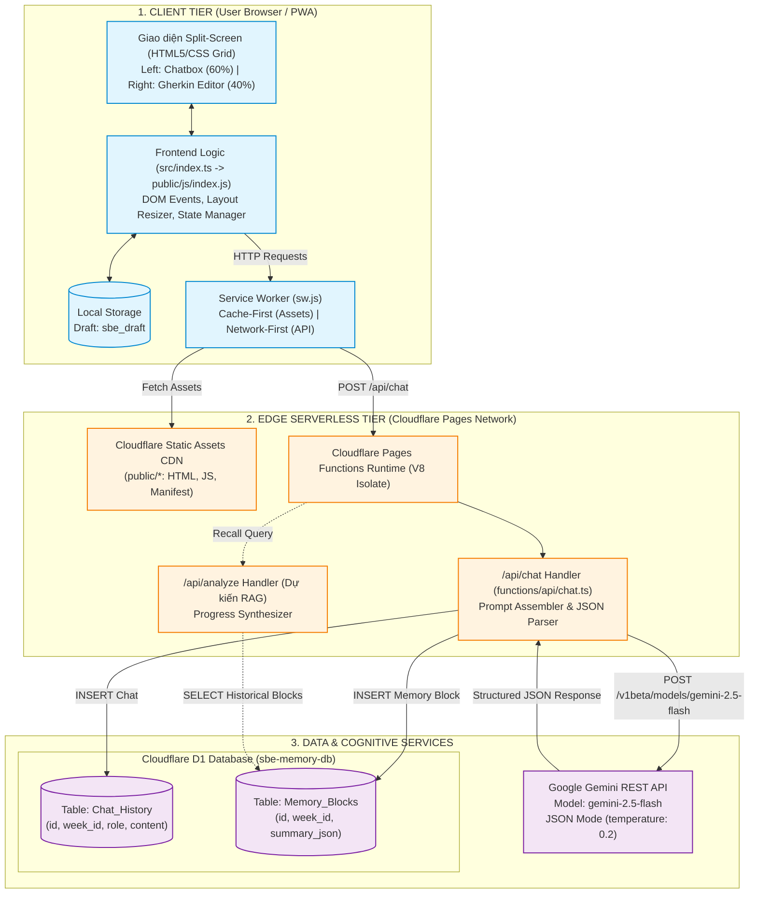
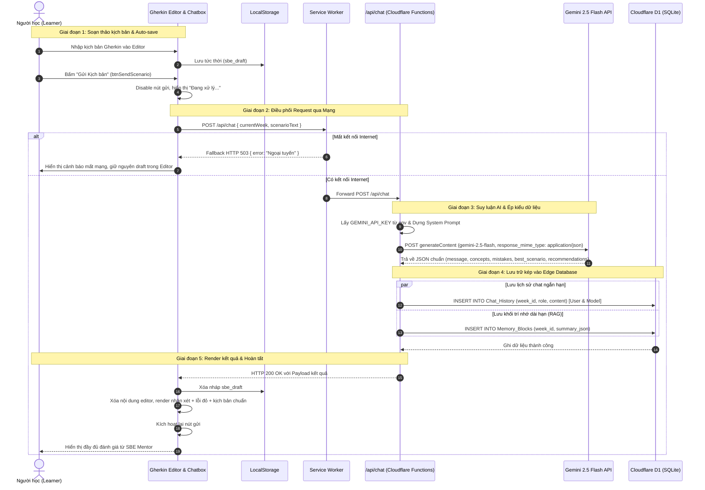
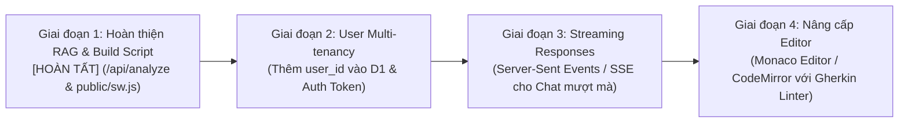

# TÀI LIỆU KIẾN TRÚC HỆ THỐNG: PERSONAL SBE ASSISTANT PWA

> **Vai trò:** Software Architect  
> **Dự án:** Personal SBE Assistant PWA  
> **Ngày cập nhật:** 2026-09-20  
> **Phiên bản:** 1.0.0

---

## 1. Tổng quan Dự án (Project Overview)

### 1.1. Mục đích & Bài toán Giải quyết

**Personal SBE Assistant PWA** là một ứng dụng trợ lý học tập cá nhân hóa chuyên sâu theo mô hình **AI Mentor**, hướng dẫn người học nắm vững phương pháp **Specification by Example (SBE)** và cú pháp kịch bản **Gherkin** trong lộ trình 4 tuần:

- **Tuần 1:** Nền tảng Gherkin (_Given - When - Then_).
- **Tuần 2:** Kịch bản tham số hóa (_Scenario Outlines & Examples Tables_).
- **Tuần 3:** Tư duy thiết kế bên ngoài vào (_Outside-In & Edge Cases_).
- **Tuần 4:** Tài liệu sống động (_Living Documentation & Refactoring_).

**Vấn đề cốt lõi được giải quyết:**

1. **Khắc phục giới hạn Context Window của LLM:** Thay vì nhồi nhét toàn bộ lịch sử hội thoại dài vào mỗi lần gọi API gây tốn chi phí và mất tập trung ("LLM forgetfulness"), hệ thống trích xuất và cô đọng tiến trình học tập thành **5 khối JSON (Memory Blocks)** có cấu trúc.
2. **Hỗ trợ RAG (Retrieval-Augmented Generation) trên Edge:** Bộ nhớ dài hạn được lưu trữ tại Cloudflare D1 trên mạng biên (Edge Network), cho phép truy vấn tổng hợp tiến trình học tập của từng tuần mà không cần hạ tầng máy chủ phức tạp.
3. **Trải nghiệm PWA & Khả năng hoạt động Ngoại tuyến (Offline-First Resiliency):** Tự động lưu nháp kịch bản (_Auto-save draft_) vào `localStorage`, Service Worker xử lý cache tài nguyên tĩnh và bắt lỗi ngắt kết nối mạng an toàn (trả về fallback HTTP 503 thay vì làm sập ứng dụng).

### 1.2. Tech Stack Chi tiết

| Tầng (Layer)                  | Công nghệ / Thư viện                                                            | Vai trò kỹ thuật & Quyết định kiến trúc                                                                                                     |
| :---------------------------- | :------------------------------------------------------------------------------ | :------------------------------------------------------------------------------------------------------------------------------------------ |
| **Client / Presentation**     | HTML5, CSS Grid/Flexbox                                                         | Giao diện Split-Screen 3 cột (Chatbox 60% - Thanh kéo chia đôi - Gherkin Editor 40%), không dùng framework nặng để tối ưu tốc độ tải trang. |
| **Client Scripting**          | TypeScript (`ES2020`, `module: ESNext`)                                         | Đảm bảo Type Safety cho Data Payload, bắt sự kiện DOM, tương tác `localStorage` và fetch API.                                               |
| **Offline & PWA**             | Service Worker (`Cache-First` + `Network-First API fallback`), Web App Manifest | Cài đặt ứng dụng lên Home Screen thiết bị (standalone), cache shell tĩnh, bắt ngoại lệ mạng khi gọi API.                                    |
| **Edge Compute / Serverless** | Cloudflare Pages Functions                                                      | Runtime V8 Isolate siêu nhẹ trên Edge, không có cold-start, đóng vai trò API Gateway xử lý endpoint `/api/chat`.                            |
| **AI / LLM Engine**           | Google Gemini 2.5 Flash (`gemini-2.5-flash`)                                    | Nhiệt độ thấp (`temperature: 0.2`), ép kiểu cấu trúc đầu ra JSON (`response_mime_type: "application/json"`).                                |
| **Database / Persistence**    | Cloudflare D1 (Distributed SQLite)                                              | Cơ sở dữ liệu quan hệ phân tán tại Edge, lưu trữ `Chat_History` và `Memory_Blocks`.                                                         |
| **CI/CD & DevOps**            | Cloudflare Pages Native CI/CD + Wrangler CLI                                    | Tự động build từ Git repository (`npm run build`), deploy tự động ra môi trường production.                                                 |

---

## 2. Phân tích Cấu trúc Thư mục & Vai trò File

```plaintext
sbe-assistant-pwa/
├── .github/                       # Cấu hình GitHub (đã lược bỏ workflow để dùng Cloudflare Native CI)
├── .wrangler/                     # Thư mục cache và state của Wrangler CLI
├── functions/                     # Backend Serverless chạy trên Cloudflare Pages Functions
│   └── api/
│       ├── chat.ts                # Edge Handler: tiếp nhận kịch bản, gọi Gemini API, ghi D1
│       └── analyze.ts             # Edge Handler (RAG): trích xuất Memory_Blocks, tổng hợp tiến độ học
├── public/                        # Thư mục đích phân phối tĩnh (Web Root của Pages)
│   ├── index.html                 # Giao diện chính: Split-Screen Layout, Chatbox & Editor
│   ├── manifest.json              # Khai báo Metadata PWA (icons, theme_color, display standalone)
│   ├── sw.js                      # Service Worker xử lý Cache Storage & bắt lỗi Offline
│   └── js/
│       └── index.js               # Mã nguồn JS được biên dịch từ src/index.ts
├── src/                           # Mã nguồn Frontend TypeScript
│   └── index.ts                   # Logic xử lý sự kiện giao diện, kéo thả resizer, gọi API, auto-save
├── .dev.vars                      # Biến môi trường local (chứa GEMINI_API_KEY, đã gitignore)
├── .gitignore                     # Bỏ qua node_modules, .dev.vars, build cache
├── package.json                   # Định nghĩa dependencies, scripts build và dev
├── schema.sql                     # Khởi tạo lược đồ DDL cho Cloudflare D1
├── tsconfig.json                  # Cấu hình TypeScript Compiler (ESNext, outDir: ./public/js)
├── wrangler.toml                  # Cấu hình Cloudflare Pages, Assets directory & D1 Database Binding
└── SBE-Assistant-Master-Document.md # Tài liệu tổng hợp kiến trúc và lộ trình gốc
```

### Vai trò chi tiết của các file trọng yếu

1. **`functions/api/chat.ts` (Backend API Gateway & Agent Controller):**
   - **Xử lý Request:** Nhận POST payload chứa `{ currentWeek, scenarioText }`.
   - **System Prompt Engineering:** Xây dựng prompt chuyên môn hóa theo từng tuần học, định nghĩa cấu trúc JSON schema bắt buộc 5 trường (`message`, `analysis.learned_concepts`, `mistakes`, `best_scenario`, `recommendations`).
   - **Gọi Gemini REST API:** Gửi payload sang endpoint `gemini-2.5-flash:generateContent` bằng fetch native với `response_mime_type: "application/json"`.
   - **Ghi dữ liệu kép vào Cloudflare D1 (`env.DB`):**
     - Lưu lượt hội thoại ngắn hạn vào bảng `Chat_History`.
     - Lưu khối kiến thức dài hạn đã chuẩn hóa vào bảng `Memory_Blocks`.
   - **Xử lý lỗi:** Bắt lỗi kết nối, trả mã trạng thái HTTP chuẩn kèm thông điệp lỗi JSON.

2. **`functions/api/analyze.ts` (Edge RAG Analyzer & Progress Synthesizer):**
   - **Xử lý Request:** Nhận POST payload chứa `{ currentWeek }`.
   - **Truy vấn Cloudflare D1:** Đọc toàn bộ các bản ghi `Memory_Blocks` từ tuần 1 đến tuần hiện tại.
   - **Xử lý Empty State:** Nếu chưa có kịch bản nào được nộp, trả về thông báo hướng dẫn gửi kịch bản.
   - **Tổng hợp Gemini RAG:** Gửi toàn bộ dữ liệu lịch sử cho Gemini 2.5 Flash phân tích tổng quan, trích xuất các khái niệm đã làm chủ, lỗi sai lặp lại, kế hoạch hành động tiếp theo và chấm điểm mức độ sẵn sàng (`readiness_score: 0-100`).

3. **`src/index.ts` (Frontend Controller & Presentation Logic):**
   - **Khôi phục & Lưu nháp:** Tự động nạp bản nháp từ `localStorage.getItem("sbe_draft")` khi khởi động; lắng nghe `input` trên editor để lưu tức thời.
   - **Resizer Controller:** Lắng nghe sự kiện chuột (`mousedown`, `mousemove`, `mouseup`) trên thanh chia đôi `#dragMe`, giới hạn tỷ lệ co giãn từ 20% đến 80%, tạm thời vô hiệu hóa `pointer-events` trên các khung để tránh giật lag.
   - **Dispatcher & Renderer:** Gửi request đến `/api/chat` và `/api/analyze`, quản lý loading states trên các nút tương ứng.
   - **Recall Dashboard:** Render thẻ tóm tắt tiến trình học tập trực quan gồm điểm sẵn sàng, danh sách khái niệm nắm vững, lỗi cần khắc phục và kế hoạch hành động.
   - **PWA Lifecycle:** Đăng ký Service Worker `/sw.js` vào browser khi tải trang.

4. **`public/index.html` (Application Shell & UI Layout):**
   - Sử dụng CSS Grid 3 cột (`60% 5px 1fr`) tạo bố cục 2 vùng làm việc song song: bên trái là khung trao đổi với AI Mentor kèm bộ lọc tuần (`weekSelector`) và nút "Tổng kết (Recall)"; bên phải là workspace viết Gherkin Editor.
   - Liên kết Web App Manifest phục vụ khả năng Add to Home Screen.

5. **`public/sw.js` (Offline Cache & Network Proxy):**
   - Định vị trực tiếp tại Web Root (`public/sw.js`) để đảm bảo scope đăng ký `/` toàn vẹn.
   - Chiến lược **Cache-First** đối với các static assets cơ bản (`/`, `/index.html`, `/js/index.js`, `/manifest.json`).
   - Chiến lược **Network-First with Graceful Fallback** cho các route API `/api/*`: nếu mất mạng, trả về `Response` giả lập HTTP 503 (`{ error: "Ngoại tuyến" }`) giúp frontend hiển thị thông báo dịu mắt thay vì vỡ giao diện.

6. **`schema.sql` (Edge Database Data Definition Language):**
   - `Chat_History`: Lưu trữ hội thoại chi tiết gồm `week_id`, `role` (`user` | `model`), `content`, `created_at`.
   - `Memory_Blocks`: Lưu trữ thực thể RAG gồm `week_id`, `summary_json` (chứa các mảng concepts, mistakes, best scenario, recommendations), `created_at`.

7. **`wrangler.toml` (Cloudflare Infrastructure as Code):**
   - Cấu hình Assets directory trỏ vào `./public`.
   - Thiết lập database binding `DB` kết nối trực tiếp với Cloudflare D1 (`sbe-memory-db`, id: `87e77f75-64f7-49c4-a3e1-e823c56a23f0`).

---

## 3. Sơ đồ Kiến trúc & Luồng Hoạt động (Mermaid.js)

### 3.1. Sơ đồ Kiến trúc Tổng thể (System Architecture Diagram)



---

### 3.2. Sơ đồ Luồng Hoạt động Chi tiết (Sequence Diagram)

Sơ đồ thể hiện chu trình phân tích kịch bản Gherkin từ lúc người dùng thao tác đến khi AI phản hồi và dữ liệu được ghi vào bộ nhớ dài hạn:



---

## 4. Đánh giá Kiến trúc & Khuyến nghị Phát triển (Architect's Assessment & Scaling Roadmap)

### 4.1. Điểm mạnh Kiến trúc (Architectural Strengths)

1. **Edge-Native Architecture:** Toàn bộ compute (`functions/api/chat.ts`), database (`Cloudflare D1`), và static assets (`public/`) đều chạy trên hạ tầng toàn cầu của Cloudflare. Thời gian phản hồi mạng (TTFB) cực thấp, không có chi phí duy trì server cố định (Zero Idle Cost).
2. **Schema-Enforced LLM Output:** Tận dụng triệt để tính năng `response_mime_type: "application/json"` của Gemini 2.5 Flash, loại bỏ rủi ro AI trả về text tự do kèm markdown khó bóc tách.
3. **Structured Long-Term Memory (RAG-Ready):** Việc phân tách rạch ròi giữa bảng `Chat_History` và `Memory_Blocks` (lưu dạng JSON 5 thành phần) giúp hệ thống sẵn sàng cho tính năng tổng kết tiến trình học mà không làm phình context window.
4. **Resilient Client:** Khả năng tự phục hồi bản nháp qua `localStorage` và xử lý graceful offline fallback tại Service Worker giúp người học không bị mất dữ liệu khi mạng chập chờn.

### 4.2. Các Điểm Cần Lưu ý & Nợ Kỹ Thuật (Technical Debt & Gotchas)

1. **Vị trí và Phạm vi của Service Worker (`sw.js` scope) - [ĐÃ HOÀN TẤT]:**
   - Đã chuyển `sw.js` trực tiếp ra thư mục Web Root `public/sw.js` và cập nhật `package.json` sang `"build": "tsc"`. Không còn phụ thuộc lệnh `mv` của hệ điều hành, đảm bảo build mượt mà trên cả Windows và Linux CI.
2. **Kích hoạt Endpoint RAG `/api/analyze` - [ĐÃ HOÀN TẤT]:**
   - Đã tạo Edge Function `functions/api/analyze.ts` truy vấn `Memory_Blocks` từ D1 và tổng hợp qua Gemini 2.5 Flash.
   - Đã kết nối nút `btnRecall` trên giao diện PWA để hiển thị trực quan Bảng tổng kết tiến trình học tập (điểm sẵn sàng, khái niệm làm chủ, lỗi sai còn lặp lại, kế hoạch hành động).
3. **Mở rộng Đa người dùng (User Multi-tenancy) - [BƯỚC TIẾP THEO]:**
   - Hai bảng `Chat_History` và `Memory_Blocks` hiện đang phục vụ theo mô hình Single-user (Personal).
   - Khi mở rộng cho nhiều người dùng đồng thời, cần bổ sung cột `user_id` vào `schema.sql` và tích hợp cơ chế xác thực (Auth via Cloudflare Access, Supabase Auth, Clerk hoặc Firebase Auth).

### 4.3. Kế hoạch Mở rộng & Nâng cấp (Scalability Roadmap)



1. **Ngắn hạn (Phase 1) - [ĐÃ ĐẠT ĐƯỢC]:**
   - Hoàn thành `functions/api/analyze.ts` và Dashboard tổng kết trên Frontend.
   - Chuẩn hóa vị trí `public/sw.js` và script build cross-platform trong `package.json`.
2. **Trung hạn (Phase 2):**
   - Cập nhật DDL schema: thêm `user_id VARCHAR(64) DEFAULT 'default_user'` và chỉ mục `CREATE INDEX idx_user_week ON Memory_Blocks(user_id, week_id)`.
   - Bổ sung xác thực người dùng.
3. **Dài hạn (Phase 3 & 4):**
   - Tối ưu trải nghiệm phản hồi của Gemini bằng cơ chế **Server-Sent Events (SSE)** giúp tin nhắn hiển thị từng từ (Streaming response).
   - Tích hợp Monaco Editor hoặc CodeMirror hỗ trợ syntax highlighting cho cú pháp Gherkin (`Given`, `When`, `Then`, `And`, `Scenario`, `Examples`).
