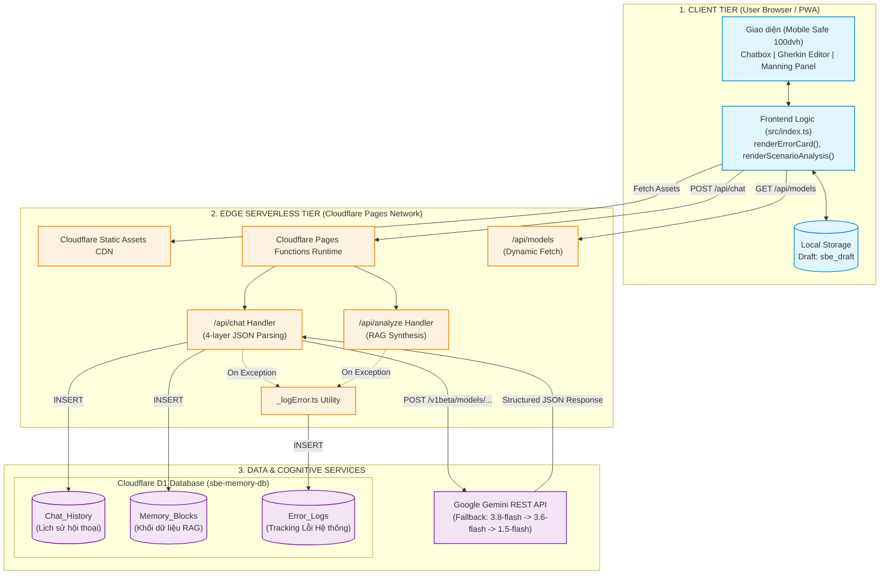

# TÀI LIỆU KIẾN TRÚC HỆ THỐNG: PERSONAL SBE ASSISTANT PWA
> **Vai trò:** Software Architect  
> **Dự án:** Personal SBE Assistant PWA  
> **Ngày cập nhật:** 2026-09-20  
> **Phiên bản:** 1.2.0  

---

## 1. Tổng quan Dự án (Project Overview)

### 1.1. Mục đích & Bài toán Giải quyết
**Personal SBE Assistant PWA** là một ứng dụng trợ lý học tập cá nhân hóa chuyên sâu theo mô hình **AI Mentor**, hướng dẫn người học nắm vững phương pháp **Specification by Example (SBE)** và cú pháp kịch bản **Gherkin** trong lộ trình 4 tuần theo **tiêu chuẩn khắt khe của sách Manning (Writing Great Specifications)**.

**Vấn đề cốt lõi được giải quyết:**
1. **Khắc phục giới hạn Context Window của LLM:** Thay vì nhồi nhét toàn bộ lịch sử hội thoại dài vào mỗi lần gọi API gây tốn chi phí và mất tập trung ("LLM forgetfulness"), hệ thống trích xuất và cô đọng tiến trình học tập thành **5 khối JSON (Memory Blocks)** có cấu trúc.
2. **Hỗ trợ RAG (Retrieval-Augmented Generation) trên Edge:** Bộ nhớ dài hạn được lưu trữ tại Cloudflare D1 trên mạng biên (Edge Network), cho phép truy vấn tổng hợp tiến trình học tập của từng tuần mà không cần hạ tầng máy chủ phức tạp.
3. **Trải nghiệm PWA & Khả năng hoạt động Ngoại tuyến (Offline-First Resiliency):** Tự động lưu nháp kịch bản (*Auto-save draft*) vào `localStorage`, Service Worker xử lý cache tài nguyên tĩnh và bắt lỗi ngắt kết nối mạng an toàn. Cải tiến UI hiển thị chính xác trên Mobile iOS Safari với `safe-area-inset` và `100dvh`.
4. **Hệ thống Đánh giá Gherkin Chuyên sâu:** Ứng dụng tích hợp bộ tiêu chí đánh giá chuẩn Manning, nhận diện `UI-Centered`, `Incidental Details`, và nguyên lý `Goldilocks`, đi kèm giao diện trực quan hiển thị lỗi (vi phạm Major/Minor) và gợi ý kịch bản chuẩn (`best_scenario`).
5. **Cơ chế Fallback Mô hình Động:** Truy vấn mô hình khả dụng mới nhất từ Google (VD: `gemini-3.8-flash`) và có cơ chế fallback tự động sang phiên bản ổn định (`gemini-3.6-flash`) nếu bị lỗi 503/404.

### 1.2. Tech Stack Chi tiết

| Tầng (Layer) | Công nghệ / Thư viện | Vai trò kỹ thuật & Quyết định kiến trúc |
| :--- | :--- | :--- |
| **Client / Presentation** | HTML5, CSS Grid/Flexbox | Giao diện Split-Screen 3 cột (Chatbox 60% - Thanh kéo chia đôi - Gherkin Editor 40%). Cập nhật Safe Area cho iOS Safari. |
| **Client Scripting** | TypeScript (`ES2020`, `module: ESNext`) | Đảm bảo Type Safety cho Data Payload, bắt sự kiện DOM, tương tác `localStorage` và fetch API. Cơ chế hiển thị `renderErrorCard` và `renderScenarioAnalysis` chuyên sâu. |
| **Offline & PWA** | Service Worker (`Cache-First` + `Network-First API fallback`), Web App Manifest | Cài đặt ứng dụng lên Home Screen thiết bị (standalone), cache shell tĩnh, bắt ngoại lệ mạng khi gọi API. |
| **Edge Compute / Serverless** | Cloudflare Pages Functions | Runtime V8 Isolate siêu nhẹ trên Edge, xử lý các endpoint API nội bộ. |
| **AI / LLM Engine** | Google Gemini API (Dynamic Auto-Fetch) | Truy vấn danh sách Models, chọn phiên bản Flash mới nhất. System Prompt ép kiểu cấu trúc đầu ra JSON gắt gao gồm cả `violations` và `style_score`. |
| **Database / Persistence** | Cloudflare D1 (Distributed SQLite) | Cơ sở dữ liệu phân tán tại Edge, lưu trữ `Chat_History`, `Memory_Blocks`, và bảng log kỹ thuật `Error_Logs`. |
| **CI/CD & DevOps** | Cloudflare Pages Native CI/CD + Wrangler CLI | Tự động build từ Git repository (`npm run build`), deploy tự động ra môi trường production. |

---

## 2. Phân tích Cấu trúc Thư mục & Vai trò File (Cập nhật)

```plaintext
sbe-assistant-pwa/
├── migrations/                    # File SQL nâng cấp Schema D1 (VD: 0002_add_error_logs.sql)
├── functions/                     # Backend Serverless chạy trên Cloudflare Pages Functions
│   └── api/
│       ├── chat.ts                # Edge Handler: nhận kịch bản, gọi Gemini API, ghi D1, xử lý 4-layer JSON parsing
│       ├── analyze.ts             # Lấy dữ liệu RAG và gửi prompt tổng kết
│       ├── models.ts              # API fetch cấu hình model động từ Google
│       └── _logError.ts           # Utility dùng chung để ghi log lỗi chuyên sâu vào D1
├── public/                        # Thư mục đích phân phối tĩnh (Web Root của Pages)
│   ├── index.html                 # Giao diện chính + Viewport 100dvh + Panel Tiêu Chuẩn Manning
│   ├── manifest.json              # Khai báo Metadata PWA
│   ├── sw.js                      # Service Worker xử lý Cache Storage & bắt lỗi Offline
│   └── js/
│       └── index.js               # Mã nguồn JS được biên dịch từ src/index.ts
├── src/                           # Mã nguồn Frontend TypeScript
│   └── index.ts                   # Chứa `renderErrorCard()`, `renderScenarioAnalysis()`
├── schema.sql                     # Khởi tạo lược đồ DDL cho Cloudflare D1
├── tsconfig.json                  # Cấu hình TypeScript Compiler
└── wrangler.jsonc                 # Cấu hình Cloudflare Pages & D1 Database Binding
```

### Vai trò chi tiết của các tính năng trọng yếu:

1. **Error Logging & User-Friendly Errors (`_logError.ts` & `renderErrorCard`):**
   - API trả về JSON chứa cấu trúc `errorCode` thay vì raw error log.
   - Frontend hiển thị Card lỗi tiếng Việt thân thiện.
   - Đối với lỗi Quota 429, hiển thị nút "Thử lại sau Xs" có đếm ngược.
   - Các chi tiết kỹ thuật (`raw_error`, `http_status`, `model`, `colo`) được tự động âm thầm log vào bảng `Error_Logs` trên D1.

2. **Safari iOS 4-Layer JSON Parsing (`chat.ts`):**
   - Giải quyết triệt để lỗi Gemini trả về markdown thừa (`gherkin ...`) bên ngoài JSON bằng 4 lớp bóc tách an toàn: (1) Parse trực tiếp -> (2) Tìm markdown block -> (3) Tìm `{...}` ngoặc nhọn -> (4) Ép text thô vào `{message}`.

3. **Manning Rules Rubric (`chat.ts`):**
   - System Prompt phân tầng theo Tuần học. Tuần 3-4 cực kỳ khắt khe, tích hợp mã lỗi (VD: `[A2] UI-Centered`, `[E2] Goldilocks`).
   - JSON output được mở rộng với `violations` array và `style_score` 0-100.

4. **Dynamic Model Fetching (`models.ts`):**
   - Không hardcode model. `/api/models` gọi API `https://generativelanguage.googleapis.com/v1beta/models` để tự tìm bản `flash` mới nhất.

---

## 3. Sơ đồ Kiến trúc & Luồng Hoạt động (Mermaid.js)

### 3.1. Sơ đồ Kiến trúc Tổng thể (System Architecture Diagram)



---

## 4. Quản lý Rủi Ro & Đánh Giá Gherkin (Manning Standards)

### Cấu trúc Dữ liệu Ràng buộc Trả về từ LLM (Dùng chung cho Chat & Analyze)
Để đảm bảo Frontend (`renderScenarioAnalysis`) hoạt động hoàn hảo, đầu ra JSON của Gemini tuân thủ nghiêm ngặt định dạng sau:
```json
{
  "message": "Nhận xét tổng quan ngắn gọn...",
  "analysis": {
    "style_score": 75,
    "learned_concepts": ["Outside-in development", "Goldilocks principle"],
    "violations": [
      {
        "code": "[A2]",
        "severity": "major",
        "step": "When user clicks the Submit button",
        "explanation": "UI-Centered: Bước này mô tả thao tác UI thay vì intent nghiệp vụ...",
        "fix": "When user submits the registration form"
      }
    ],
    "mistakes": ["Lỗi syntax cơ bản (nếu có)"],
    "best_scenario": "Feature: ...",
    "recommendations": ["Lời khuyên 1", "Lời khuyên 2"]
  }
}
```

### Xử Lý An Toàn Bóc Tách Dữ Liệu (Fail-Safe JSON)
Hệ thống sử dụng try-catch đa tầng lồng nhau để xử lý các mô hình có xu hướng "nhiều lời":
1. **Tầng 1:** `JSON.parse(aiText)` nguyên bản.
2. **Tầng 2:** Regex trích xuất nội dung bên trong cặp backticks ```json ... ```.
3. **Tầng 3:** Trích xuất từ dấu `{` đầu tiên đến dấu `}` cuối cùng.
4. **Tầng 4 (Fallback cuối cùng):** Trả về một JSON nhân tạo chứa text gốc thô trong thuộc tính `message` để tránh ứng dụng bị crash.

### Cơ Chế Fallback Mô Hình (High Availability)
Nếu Model X gặp lỗi Quota (429), Deprecated (404), hoặc Overload (503), Server sẽ tự động Retry với các mô hình dự phòng nằm trong danh sách ưu tiên cấu hình tại `chat.ts` (ví dụ: `gemini-3.6-flash`, sau đó xuống `gemini-1.5-flash`). Chỉ log lỗi thô vào `Error_Logs` để admin xử lý, không bao giờ lộ Raw Exception lên người dùng.

---

## 5. Lịch sử Cập nhật Kiến trúc (Gần Nhất)

*   **Phase 16:** Chuyển đổi kiến trúc chọn Model từ tĩnh (Static Hardcode) sang lấy tự động bằng API Google (Dynamic Fetch `models.ts`).
*   **Phase 17:** Fix lỗi Safari iOS JSON Parsing (4-Layer Parse) và áp dụng `viewport-fit=cover`, CSS `100dvh` xử lý vấn đề khuất màn hình trên di động.
*   **Phase 18:** Tách biệt Log Lỗi Kỹ Thuật (ghi vào D1 `Error_Logs`) và Thông Báo Lỗi Người Dùng. Thiết kế lại UI thông báo lỗi với Component Card, hỗ trợ đồng hồ đếm ngược Retry khi gặp lỗi giới hạn Quota 429.
*   **Phase 19:** Tích hợp bộ quy chuẩn đánh giá Gherkin Manning (Hiển thị thẻ `violations` theo `severity`, `style_score` và nút chức năng xem Tiêu Chuẩn nổi trên UI).
*   **Phase 20:** Củng cố System Prompt nghiêm ngặt, rà soát ép buộc các lỗi "Declarative vs Imperative (HOW vs WHAT)", "Goldilocks Class of Equivalence" và "SQL-like Tables".
